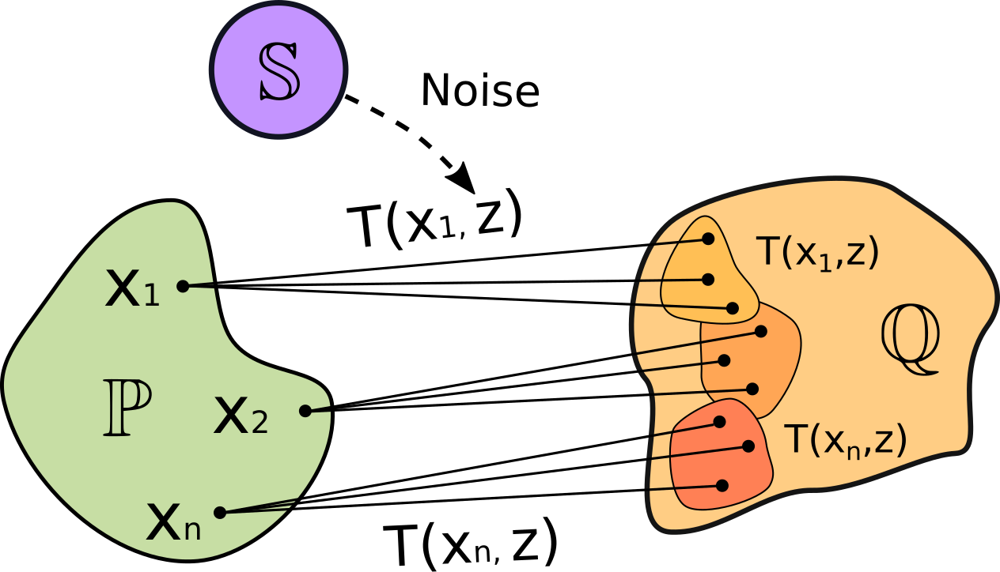
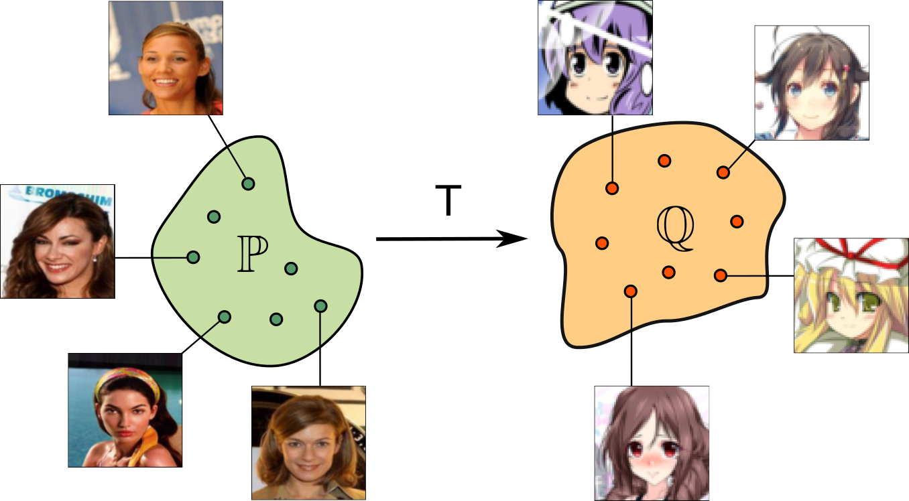
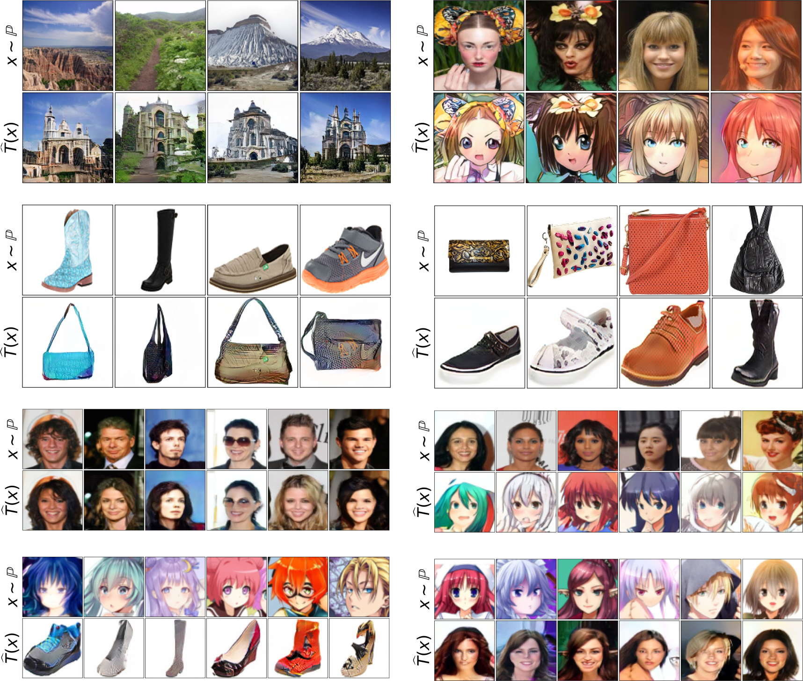
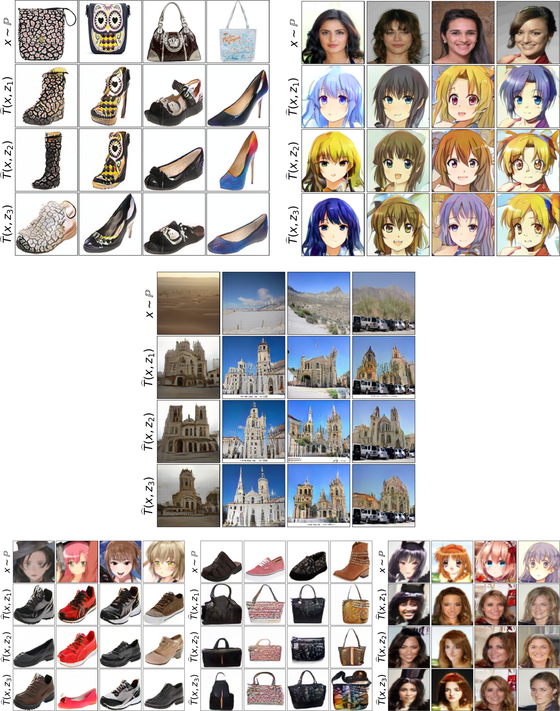
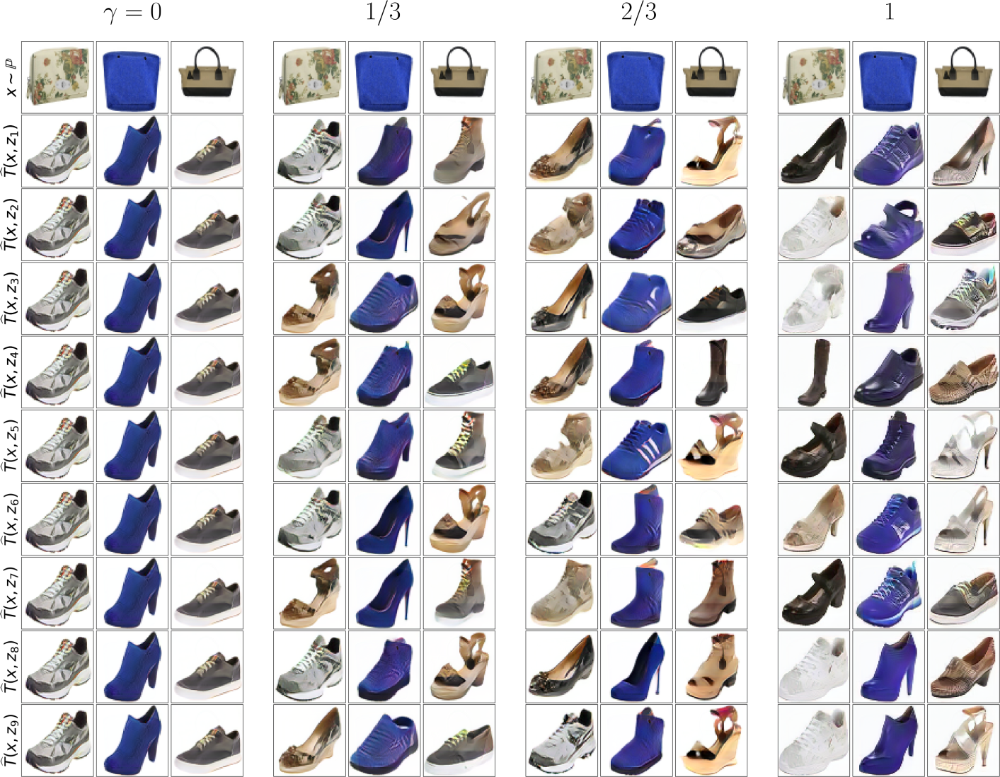

# Neural Optimal Transport (NOT)
This is the official `Python` implementation of the [ICLR 2023](https://iclr.cc) spotlight paper **Neural Optimal Transport** (NOT paper on [openreview](https://openreview.net/forum?id=d8CBRlWNkqH)) by [Alexander Korotin](https://scholar.google.ru/citations?user=1rIIvjAAAAAJ&hl=en), [Daniil Selikhanovych](https://scholar.google.com/citations?user=ZpZhN3QAAAAJ&hl=en) and [Evgeny Burnaev](https://scholar.google.ru/citations?user=pCRdcOwAAAAJ&hl=ru).

The repository contains reproducible `PyTorch` source code for computing **optimal transport** (OT) **maps and plans** for *strong* and *weak* transport costs in high dimensions with neural networks. Examples are provided for toy problems (1D, 2D) and for the unpaired image-to-image translation task for various pairs of datasets.

<p align="center"></p>

## Repository structure
The implementation is GPU-based with the multi-GPU support. Tested with `torch== 1.9.0` and 1-4 Tesla V100.

All the experiments are issued in the form of pretty self-explanatory jupyter notebooks (`notebooks/`). For convenience, the majority of the evaluation output is preserved. Auxilary source code is moved to `.py` modules (`src/`).
- ```notebooks/NOT_toy_1D.ipynb``` - toy experiments in 1D (weak costs);
- ```notebooks/NOT_toy_2D.ipynb``` - toy experiments in 2D (weak costs);
- ```notebooks/NOT_training_strong.ipynb``` - unpaired image-to-image translation (**one-to-one**, strong costs);
- ```notebooks/NOT_training_weak.ipynb``` - unpaired image-to-image translation (**one-to-many**, weak costs);
- ```notebooks/NOT_plots.ipynb``` - plotting the translation results ([pre-trained models](https://disk.yandex.ru/d/YK7V6qoUt9x1iA) are needed);
- ```stats/compute_stats.ipynb``` - pre-compute [InceptionV3](https://en.wikipedia.org/wiki/Inceptionv3) statistics to speed up test [FID](https://arxiv.org/abs/1706.08500) computation;

## Setup

To run the notebooks, it is recommended to create a virtual environment using either [`conda`](https://conda.io/projects/conda/en/latest/user-guide/tasks/manage-environments.html#creating-an-environment-with-commands) or [`venv`](https://docs.python.org/3/library/venv.html). Once the virtual environment is set up, install the required dependencies by running the following command:

```console
pip install -r requirements.txt
```

Finally, make sure to install `torch` and `torchvision`. It is advisable to install these packages based on your system and `CUDA` version. Please refer to the [official website](https://pytorch.org) for detailed installation instructions.

## Educational Materials
- [Seminar](https://github.com/iamalexkorotin/NeuralOptimalTransport/blob/main/seminars/NOT_seminar_strong.ipynb) and [solutions](https://github.com/iamalexkorotin/NeuralOptimalTransport/blob/main/seminars/NOT_seminar_strong_solutions.ipynb) on NOT with **strong** costs;
- [Seminar](https://github.com/iamalexkorotin/NeuralOptimalTransport/blob/main/seminars/NOT_seminar_weak.ipynb) and [solutions](https://github.com/iamalexkorotin/NeuralOptimalTransport/blob/main/seminars/NOT_seminar_weak_solutions.ipynb) on NOT with **weak** costs;
- Vector \*.svg [sources](https://github.com/iamalexkorotin/NeuralOptimalTransport/blob/main/pics/NOT_figures.svg) of the figures in the paper (use [inkscape](https://inkscape.org/) to edit);

## Citation
```
@inproceedings{
    korotin2023neural,
    title={Neural Optimal Transport},
    author={Korotin, Alexander and Selikhanovych, Daniil and Burnaev, Evgeny},
    booktitle={International Conference on Learning Representations},
    year={2023},
    url={https://openreview.net/forum?id=d8CBRlWNkqH}
}
```

## Application to Unpaired Image-to-Image Translation Task
The unpaired domain translation task can be posed as an OT problem. Our NOT algorithm is applicable here. It searches for a transport map with the minimal transport cost (we use $\ell^{2}$), i.e., it naturally aims to preserve certain image attributes during the translation.
<p align="center"></p>

Compared to the popular image-to-image translation models based on GANs or diffusion models, our method provides the following key advantages
- **controlable amount of diversity** in generated samples (**without** any duct tape or heuristics);
- **better interpretability** of the learned map.

Qualitative examples are shown below for various pairs of datasets (at resolutions $128\times 128$ and $64\times 64$).

### One-to-one translation, strong OT
We show unpaired translition with NOT with the strong quadratic cost on *outdoor → church*, *celeba (female) → anime*, *shoes → handbags*, *handbags → shoes*, *male → female*, *celeba (female) → anime*, *anime → shoes*, *anime → celeba (female)* dataset pairs.
<p align="center"></p>

### One-to-many translation, weak OT
We show unpaired translition with NOT with the $\gamma$-weak quadratic cost on *handbags → shoes*, *celeba (female) → anime*, *outdoor → church*, *anime → shoes*, *shoes → handbags*, *anime → celeba (female)* dataset pairs.
<p align="center"></p>

### Controlling the amount of diversity
Our method offers a single parameter $\gamma\in[0,+\infty)$ in the weak quadratic cost to control the amount of diversity.
<p align="center"></p>

## Datasets
- [Aligned anime faces](https://www.kaggle.com/datasets/reitanaka/alignedanimefaces) (105GB) should be pre-processed with ```datasets/preprocess.ipynb```;
- [CelebA faces](https://mmlab.ie.cuhk.edu.hk/projects/CelebA.html) requires ```datasets/list_attr_celeba.ipynb```;
- Handbags, shoes, churches, outdoor [datasets](https://github.com/junyanz/iGAN/blob/master/train_dcgan/README.md);

The dataloaders can be created by ```load_dataset``` function from ```src/tools.py```. The latter four datasets get loaded directly to RAM.

## Presentations
- Long talk (Part [1](https://www.youtube.com/watch?v=GEpUoqpBul8&feature=youtu.be), [2](https://youtu.be/3QysEOdnDds)) by Alex Korotin at AI in Industry Seminar at [CS MSU]([https://iclr.cc/Conferences/2023](https://cs.msu.ru/)) (November 2023, RU)
- Long talk by Alex Korotin at Math in ML Seminar at Skoltech (November 2023, RU)
- Short talk by Alex Korotin at [DataStart 2023](https://datastart.ru/) (November 2023, RU)
- Short Talk by Alex Korotin at [FallML 2023](https://cs.hse.ru/ml2023/)  (November 2023, EN)
- Long talk (Part [1](https://www.youtube.com/watch?v=mBEx46WnD80), [2](https://www.youtube.com/watch?v=r214pzFTZLo)) by Alex Korotin at [AIRI Summer School 2023](https://iclr.cc/Conferences/2023) (July 2023, RU)
- [Talk](https://iclr.cc/virtual/2023/poster/11993) by Alex Korotin at [ICLR 2023](https://iclr.cc/Conferences/2023) (May 2023, EN)
- [Talk](https://www.youtube.com/watch?v=djLNOnncqRY) by Evgeny Burnaev at [Scientific AI seminar](https://www.youtube.com/@aiseminars) (March 2023, RU)
- [Short Talk](https://www.youtube.com/watch?v=w2ufVBoPH5E&t=1476s) by Evgeny Burnaev at [Fall into ML school](https://cs.hse.ru/ml2022/) (02 November 2022, RU);
- [Talk](https://www.youtube.com/live/mPpt4qBMIj4) by Alexander Korotin at [Seminar of "AI in Industry" association](https://csr-nw.ru/news/detail.php?ID=1941) (13 October 2022, RU);
- [Talk](https://www.youtube.com/watch?v=uxO4JQO3bE8) by Alexander Korotin at [AIRI conference on AI 2022](https://csr-nw.ru/news/detail.php?ID=1941) (21 July 2022, RU);
- [Talk](https://www.youtube.com/watch?v=tMfn_Tbcakc) by Alexander Korotin at [TII seminar](https://www.tii.ae/seminar/aidrc-seminar-series-alexander-korotin) (09 Aug 2022, EN);
- [Talk](https://www.youtube.com/watch?v=OfDDaW7-N2I) by Alexander Korotin at [BayesGroup research seminar](https://bayesgroup.ru/teaching/research-seminar-on-bayesian-methods-in-machine-learning/) (20 May 2022, RU, [slides](https://drive.google.com/file/d/1ce-Ge7IaA3_K5DVwa5cRbdxO9yFMBvh1/view?usp=sharing));
- [Short Talk](https://vk.com/video-70630039_456239270?t=1500s) by Alexander Korotin at [Data Fusion 2022 Conference](https://data-fusion.ru/data-fusion-2022/) (15 April 2022, RU);
- Talk by Alexander Korotin at LEStart Seminar at [Skoltech](https://www.skoltech.ru/en/) (24 February 2022, RU);

## Related repositories
- [Repository](https://github.com/iamalexkorotin/KernelNeuralOptimalTransport) for [Kernel Neural Optimal Transport](https://arxiv.org/abs/2205.15269) paper (ICLR 2023).
- [Repository](https://github.com/justkolesov/Wasserstein1Benchmark) for [Kantorovich Strikes Back! Wasserstein GANs are not Optimal Transport?](https://arxiv.org/abs/2206.07767) paper (NeurIPS 2022).
- [Repository](https://github.com/iamalexkorotin/WassersteinIterativeNetworks) for [Wasserstein Iterative Networks for Barycenter Estimation](https://arxiv.org/abs/2201.12245) paper (NeurIPS 2022).
- [Repository](https://github.com/iamalexkorotin/Wasserstein2Benchmark) for [Do Neural Optimal Transport Solvers Work? A Continuous Wasserstein-2 Benchmark](https://arxiv.org/abs/2106.01954) paper (NeurIPS 2021).

## Credits
- [Weights & Biases](https://wandb.ai) developer tools for machine learning;
- [pytorch-fid repo](https://github.com/mseitzer/pytorch-fid) to compute [FID](https://arxiv.org/abs/1706.08500) score;
- [UNet architecture](https://github.com/milesial/Pytorch-UNet) for transporter network;
- [ResNet architectures](https://github.com/harryliew/WGAN-QC) for generator and discriminator;
- [Inkscape](https://inkscape.org/) for the awesome editor for vector graphics;
